## About
Last Updated *[12/08/2020]*   
Created by [Addison Van Zandbergen-Headrick (she/her), Arizona State University GSUP]

Contact Info: agvanza1@asu.edu

## Table of Contents
- Introduction to GEE and CAP LTER
- Accessing GEE
- Manual Classification
- Conclusion

## Introduction to GEE and CAP LTER

 Google Earth Engine (GEE) is a platform for scientific analysis and visualization of geospatial datasets, for academic, non-profit, business and government users. GEE hosts satellite imagery and stores it in a public data archive that includes historical earth images going back more than forty years. The images, ingested on a daily basis, are then made available for global-scale data mining. Earth Engine also provides APIs and other tools to enable the analysis of large datasets. Earth Engine provides easy, web-based access to an extensive catalog of satellite imagery and other geospatial data in an analysis-ready format. The data catalog is paired with scalable compute power backed by Google data centers and flexible APIs that let you seamlessly implement your existing geospatial workflows. This enables cutting-edge, global scale analysis and visualization.

 The Central Arizona-Phoenix Long-Term Ecological Research (CAP LTER) project is one of 26 LTER sites funded by the National Science Foundation. Launched in 1997 along with the Baltimore Ecosystem Study (BES) as the first urban LTER sites, CAP LTER has been instrumental in establishing urban ecology as a recognized and important area of ecological inquiry. The central research question that guides the project's research is: How do the services provided by evolving urban ecosystems affect human outcomes and behavior, and how does human action (responses) alter patterns of ecosystem structure and function, and ultimately, urban sustainability, in a dynamic environment? With an emphasis on ecosystem services, sustainability, and change, we ask three subsidiary research questions corresponding to different portions of our conceptual framework:

Urban ecosystem services: How does urbanization change the structure and function of ecosystems and thereby alter the services provided by those ecosystems?

Human outcomes and actions/responses: How do people perceive and respond to ecosystem services, how are the services’ effects distributed spatially and with reference to characteristics of the population, and how do individual and collective behaviors further change ecosystem structure and function?

Urbanization in a dynamic world: How does the larger context of biophysical drivers (e.g., climate change) and societal drivers (e.g., immigration or regional urbanization) influence the interaction and feedbacks between ecosystems and society as mediated through ecosystem services, and thereby influence the future of the urban ecosystem?

In addressing these questions, CAP LTER researchers focus on a broad geographic area in central Arizona and metropolitan Phoenix where two major desert tributaries of the Colorado River, the Salt and Gila Rivers, converge. The edges of this geographic focal area remain fluid to allow scientists to investigate urban influences beyond these boundaries, conduct comparative work, and examine issues related to the growing megapolitan area between the greater Phoenix and Tucson areas. CAP LTER's conceptual framework illustrates the major press and pulse events that drive changes in the geophysical and socio-cultural-economic templates. Land-use change, land-cover change, and legacies are important foci for CAP research. Other changes to the desert ecosystem through housing and urban infrastructure development, the construction and management of urban landscapes, and alterations to the hydrologic system are also important press events. CAP addresses these issues through a series of long-term monitoring and experimentation efforts as well as other projects to elucidate patterns and processes in the urban socioecosystem.

## Accessing GEE

 You should have received (or will soon be receiving) a link to the classification project in GEE by email. Simply, click on this link and you will be taken to the project. Once you have access, it is important that you DO NOT edit the code in any way. If you do accidentally edit the code and don't know how to fix it, take send me an email. I have backups just in case something happens! On this note, to avoid losing any progress due to a simple error, please save often and exit without saving if any mistakes are made. 

## Manual Classification
1. When you first open GEE, it should look like the image below. If it does not, click "Run" and it should show up.

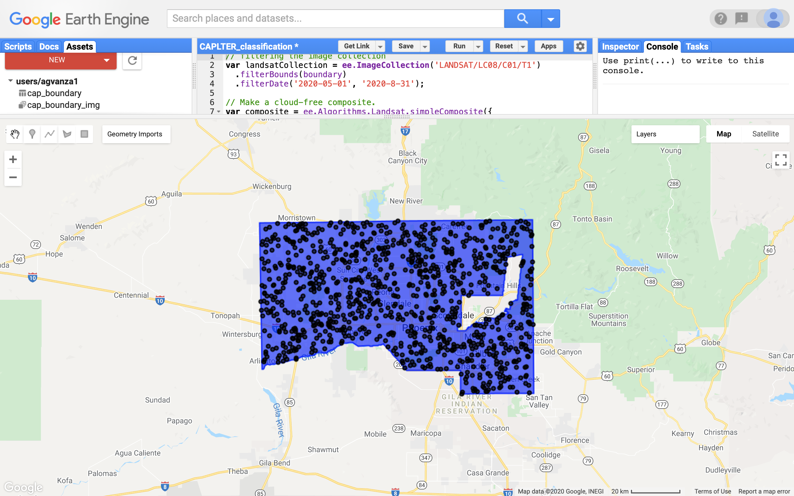

2. Next, select "Layers" and make sure only "random points" is selected. 

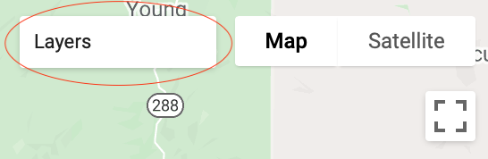

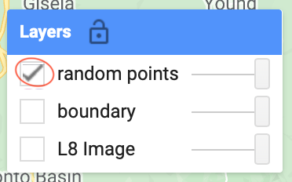

3. Then, change the view from "Map" to "Satellite". The screen should then look like the image below. Using this satellite imagery makes it easier to identify land cover classes. 

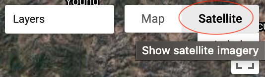

4. Hover over "Geometry Imports" and make sure all of the boxes are checked. This allows you to see which points have already been classified. You can also uncheck the box to hide the classified points when needed (ex. If a classification marker blocks an unclassified point).

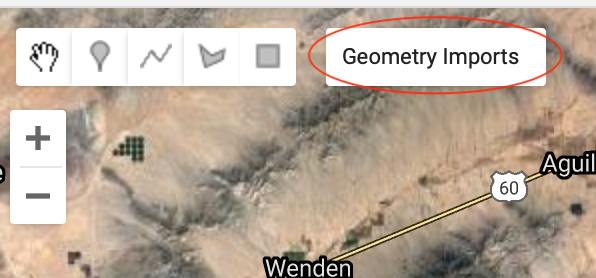

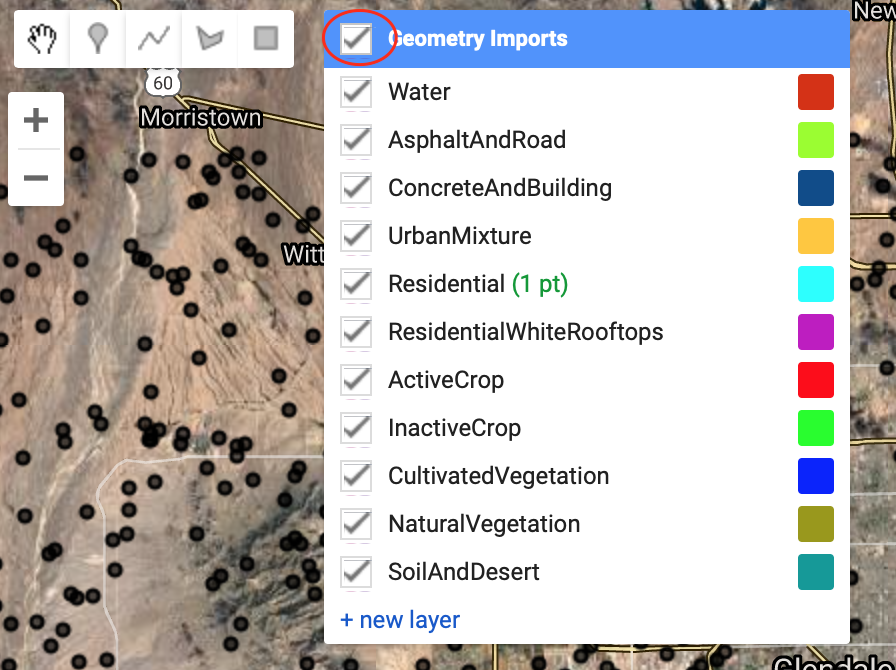

5. Find an unclassified point (a black dot on the map) and zoom in as much as possible. 

6. Determine the land cover class this point belongs to by turning  "L8 Image" in layers on and off as much as needed. Compare the L8 pixel to the area around the point in the satellite image, deciding what landcover class makes up the majority of this pixel. (There is a landcover class guide attached at the end of this document. If you are unsure, please skip the point and move on to the next.)

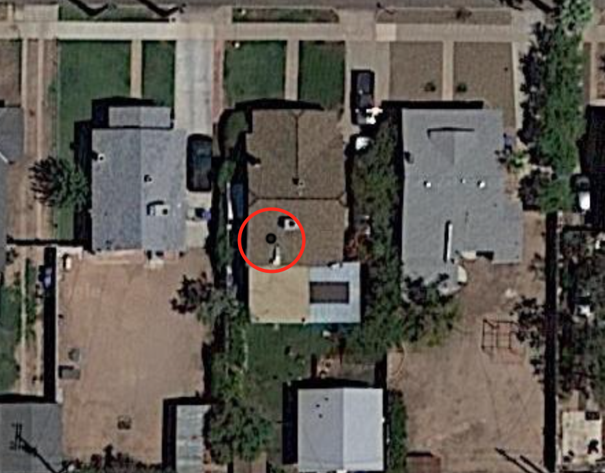

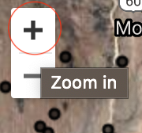

7. Go back to "Geometry Imports" and select the correct class. 

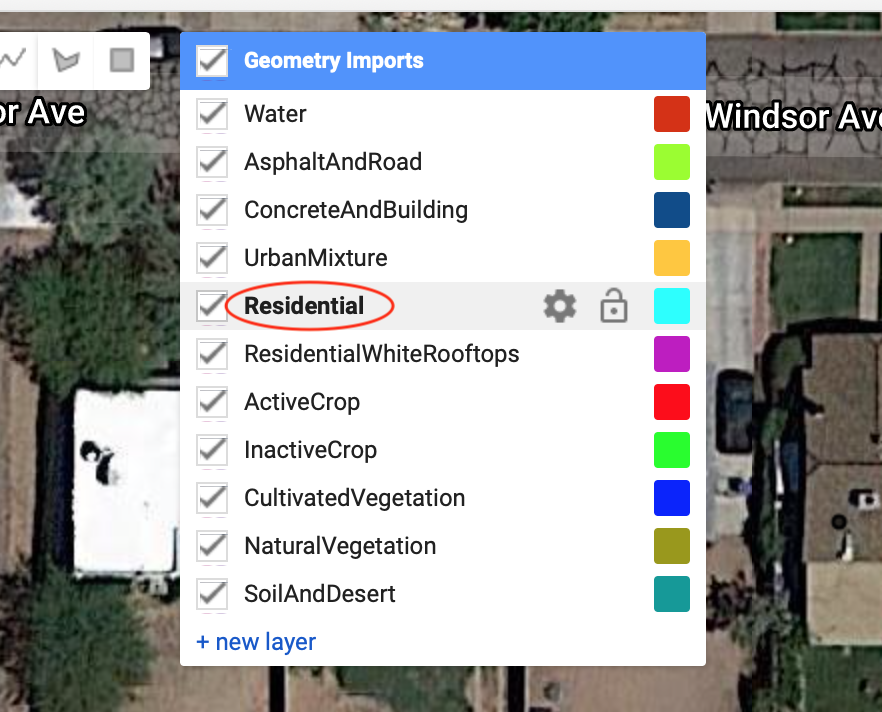

8. Then click "Add a Marker" and place a marker in the center of the point.

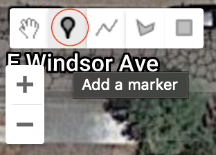

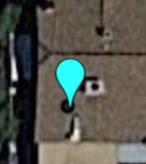

9. When done, click "Exit" on the "Point Drawing" toolbar. (Note: you can change land cover classes without having to exit after each marker is placed. Simply repeat steps 5 and 7.) 

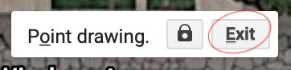

10. Repeat this process for the rest of the points and SAVE OFTEN.

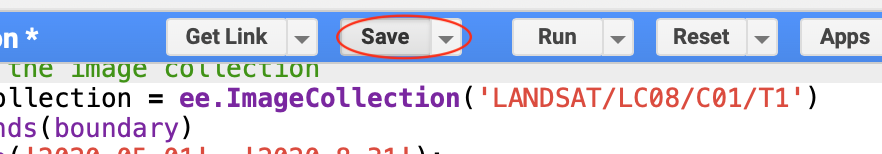

11. If you need to delete a point, repeat step 8, click on the point you wish to delete and click "Delete" on the toolbar that pops up. 

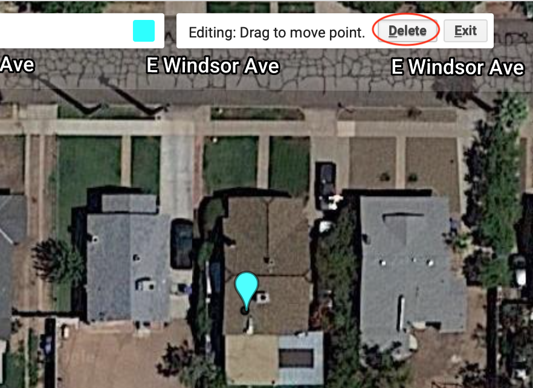

## Land cover Class Descriptions
Water: This class includes lakes, canal and other small water bodies.

Asphalt/Road (AsphaltAndRoad): This class mainly identifies transportation lines and other paved surface covered by asphalt, such as parking lots and commercial centers. This class doesn't include most of the road segments within a residential block.

Concrete/Buildings (ConcreteAndBuildings): This class mainly identifies commercial and industrial buildings. It also includes concrete covered areas.

Urban Mixture (UrbanMixture): This class identifies mixture of constructed materials, fragmented vegetation and paved surface.

Residential: This class includes various dwellings such as neighborhoods, apartments, and rural lots.

Residential, white rooftops (ResidentialWhiteRooftops): This class identifies cluster of residential buildings that have bright (usually white) rooftops, such as aluminum roofed house trailers and foam-based flat roofing.

Active crop (ActiveCrop): This class identifies croplands that covered by green vegetation.

Inactive crop (InactiveCrop): This class identifies croplands that don't have green vegetation.

Cultivated vegetation (CultivatedVegetation): This class includes urban green space such as golf courses and parks.

Natural vegetation (NaturalVegetation): This class includes vegetation grown in desert or riparian area, such as shrubs.

Soil/Desert (SoilAndDesert): This class includes bare soil, desert, and any undeveloped or open land.

Note: Due to naming requirements in GEE, non-numerical/alphabetical characters could not be used. Classes containing multiple words have been joined together and appear in GEE as the names in parentheses beside their class name.

## Conclusion
If you run into any issues, please contact me. This is a fairly simple project, but anything involving technology can have its quirks. 
